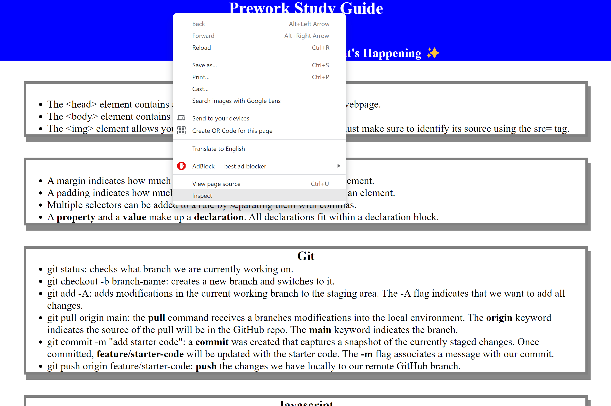
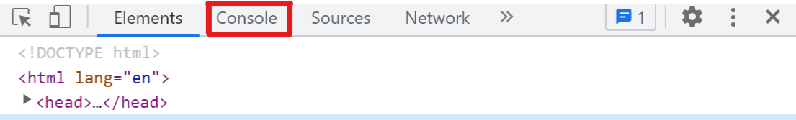
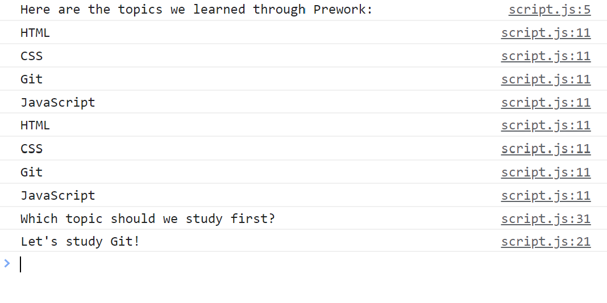

# Prework Study Guide Webpage

## Description

The purpose of this project is to provide new students with a reference guide for basic terminology needed before beginning bootcamp. This reference guide includes terminology for HTML, CSS, JavaScript, and Git. Rather than Googling issues as they pop up, or sorting through information on Canvas, this reference guide provides a brief, but detailed bulleted list of the major concepts covered in the prework section of the coding bootcamp course. 

Developing this guide allowed me to get hands on experience with HTML, CSS, JavaScript, and the Git workflow, as well as VS Code and GitBash. 

## Installation

N/A

## Usage

The Prework Study Guide can simply be used as a study guide for students to reference throughout bootcamp. It also includes an interactive JavaScript element. There is a JavaScript function built into the website which randomly generates a message for users suggesting what to study next. 

First, right-click anywhere on the page and click the "Inspect" option from the dropdown menu. This will open Chrome DevTools. You can also press Control+Shift+I (Windows), or Command+Option+I (macOS). This will open a console panel in the browser window.

Next, click on the "Console" option from the top of the menu that appears.

You should see a list of the Prework Study Guide topics. At the bottom of the list, you will see a suggestion on which topic you may want to study first. Finally, refresh the page a few times to see the function at work as it randomly generates a topic to study. 

## Credits

List your collaborators, if any, with links to their GitHub profiles.

If you used any third-party assets that require attribution, list the creators with links to their primary web presence in this section.

If you followed tutorials, include links to those here as well.

## License

Please refer to the LICENSE in the repo.